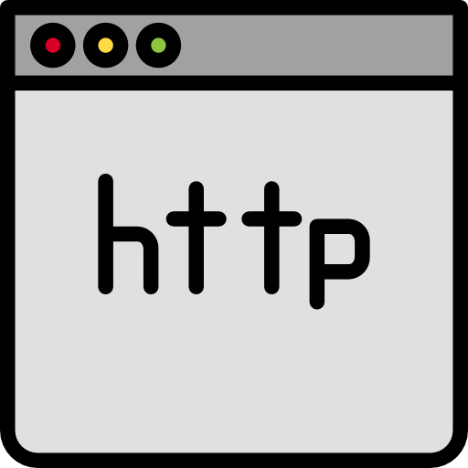

<!----- FORKS - STARTS ----->

  
[![Forks][forks-shield]][forks-url]
[![Stargazers][stars-shield]][stars-url]

<!----- LOGO INICIAL ----->

 

  

  <h3 align="center">My Website</h3>

  

    Meu Website com várias ferramentas
     
     
    <a href="https://github.com/0DarkMode0?tab=repositories"><strong>Meus Projetos</strong></a>
  

<!----- INICIO PROJETO ----->

##

![Product Name Screen Shot][product-screenshot]

No meu website você encontra várias ferramentas úteis.

Ferramentas:
* Dark-Spammer
* Fast-Spammer

<!-- LINKS - IMAGENS -->
[forks-shield]: https://img.shields.io/github/forks/0DarkMode0/0DarkMode0.github.io.svg?style=for-the-badge
[forks-url]: https://github.com/0DarkMode0/0DarkMode0.github.io/network/members
[stars-shield]: https://img.shields.io/github/stars/0DarkMode0/0DarkMode0.github.io.svg?style=for-the-badge
[stars-url]: https://github.com/0DarkMode0/0DarkMode0.github.io/stargazers
[product-screenshot]: img/projeto.png
